# ESP8266ChromaControl
Uses Chroma Control SDK to wirelessly sync any ESP8266 controlled lights such as NeoPixels. It currently does not function due to a lack of Razer GUID, however you are currently able to setup a basic test in order to confirm that your have correctly setup an ESP8266 for it to connect with the software.

## ESP8266 Setup
This tutorial assumes that you have the Arduino IDE installed. Installation instructions can be found [here](https://www.arduino.cc/en/software)

### Installing Libraries
In order to load the program onto the Arduino, you are going to need a couple of libraries, [ESP8266/Arduino](https://github.com/esp8266/Arduino) and [Adafruit_NeoPixel](https://github.com/adafruit/Adafruit_NeoPixel). The Adafruit_NeoPixel library will control WS2812 LED strips, which is the easiest LED strip to obtain currently.

#### Preparing the ESP8266 Board Library
In the Arduino IDE, select "File>Preferences" as shown below:

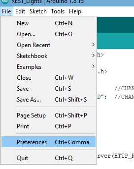

In the menu that pops up, select the button at the end of the text box for "Additional Board Manager URLs"

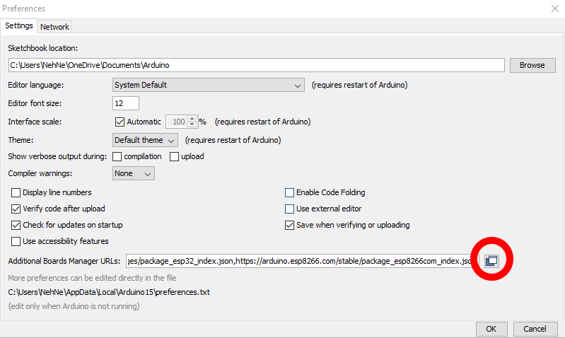

In this new window, add the text `https://arduino.esp8266.com/stable/package_esp8266com_index.json` on it's own line, then select "OK" until all dialogs disappear

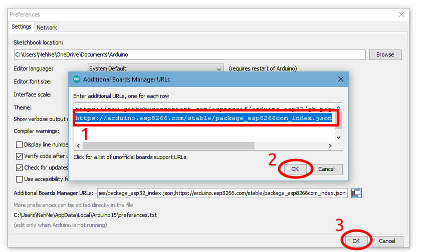

Now select "Tools>Board>Boards Manager"

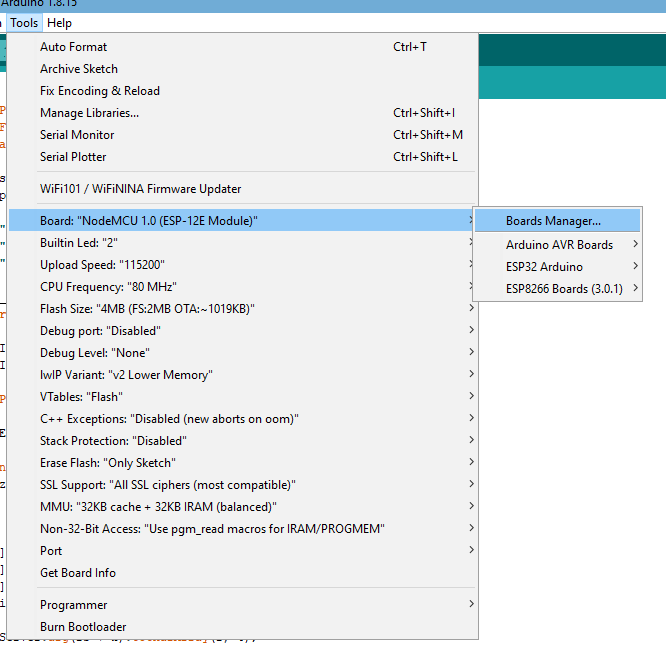

In the new window, search for `ESP8266` and install the package that appears. Close this window.

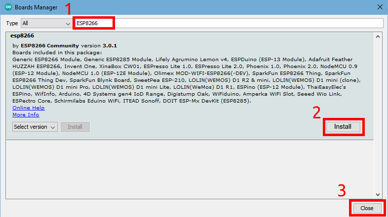

Now, select "Tools>Board>ESP8266 Boards (x.x.x)>YourBoard". You should be able to find the type of board that you bought from the store page, but worst case you might have to select through different boards until you find one that compiles.

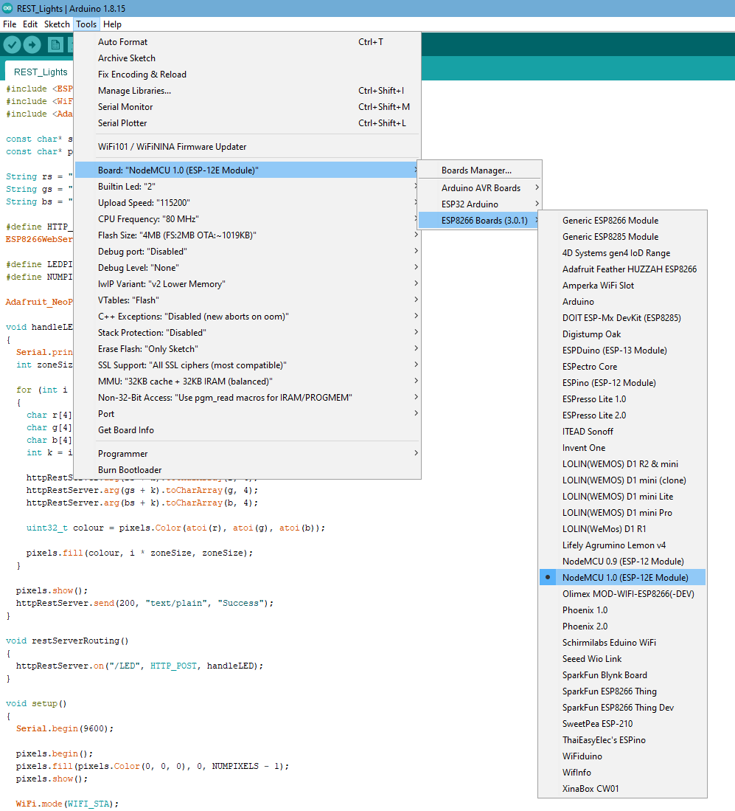

The ESP8266 Libraries you need should now be installed!

#### Preparing Adafruit_NeoPixel Library
In the Arduino IDE, select "Tools>Manage Libraries"

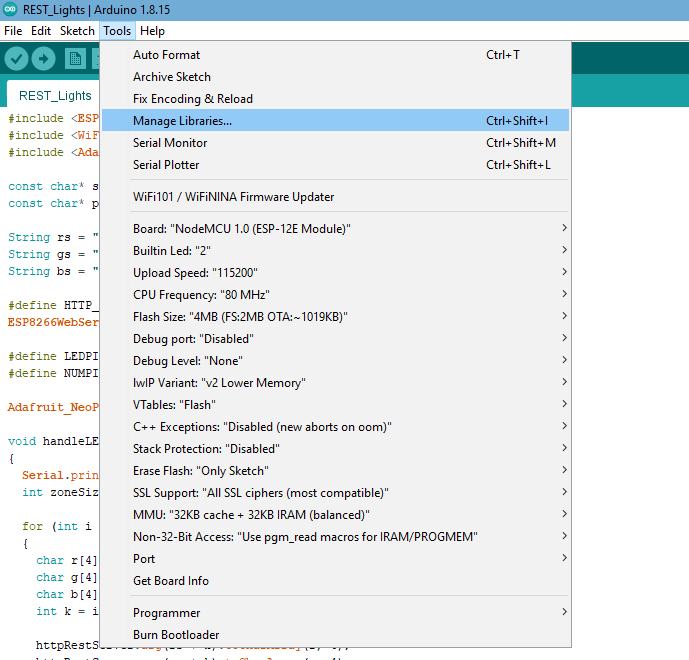

In the new window, search for `Adafruit NeoPixel` and install the one shown in the image below, then close the window:

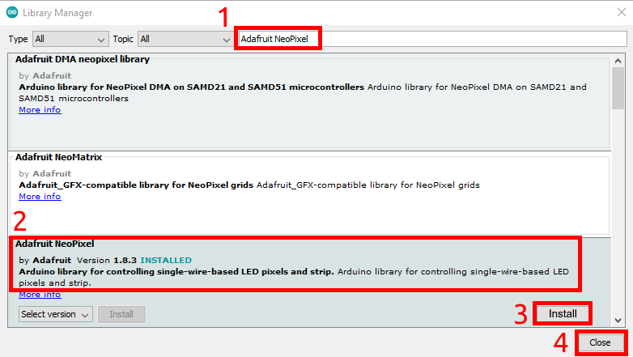

You are now almost ready to start modifying the code!

### Customizing and Uploading Arduino Code

There are only 5 possible modifications required in order to make this code function on your ESP8266 board. First you must change the `ssid` and `pass` fields to your local wireless network's name and password. Next you may need to change the `SerialCommunicationSpeed` to the speed that is specified for your board. After that you will need to set which data pin you wish to connect the LED strip to. Finally, set the number of LEDs in your strip.

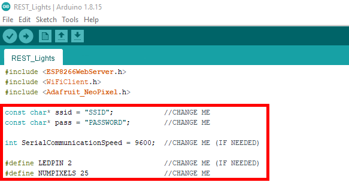

Next, connect your ESP8266 board to the computer and make sure that it is recognized. You can check if it is recognized by using the "Device Manager" program built into windows. If it is recognized, it will appear as a serial device under the `Ports (COM & LPT)` header.

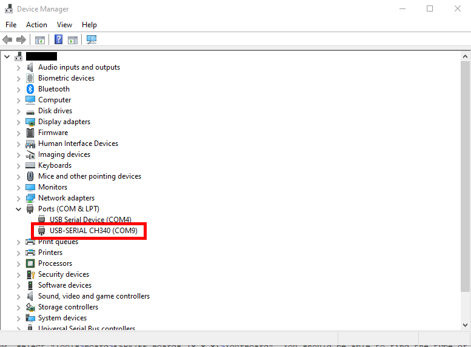

In the case that the device is not automatically recognized, you may have to install additional drivers. You can make sure your device is working, but not recognized, by looking for it under the `Other devices` header

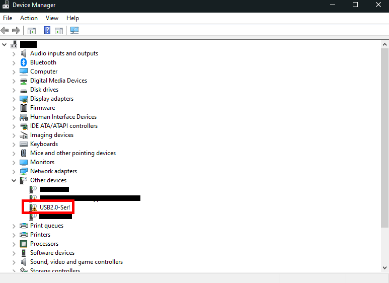

A common missing driver is the CH340 driver. Instructions for installing this driver can be found [here](https://electropeak.com/learn/how-to-install-ch340-driver/).

Once you have verified that your device is being recognized, take note of the COM port listed in "Device Manager", as you will need to select it in the Arduino IDE under "Tools>Port".

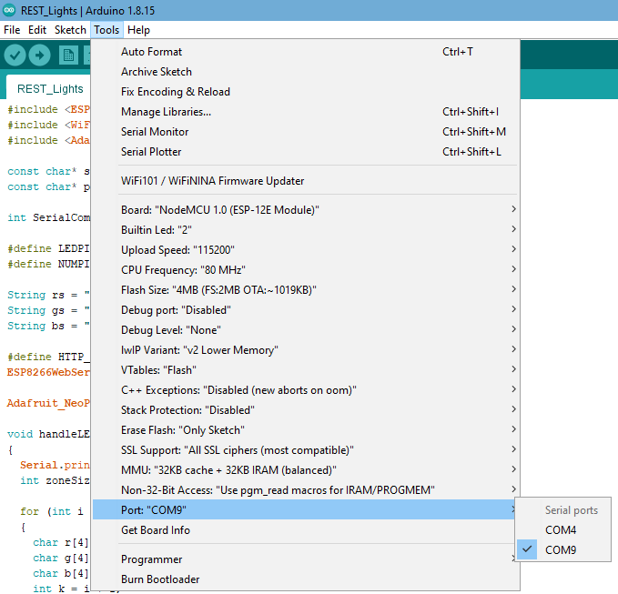

Now, in order to catch an important boot message, you must open the serial monitor found under "Tools>Serial Monitor". This will open a new window that you can forget about for now.

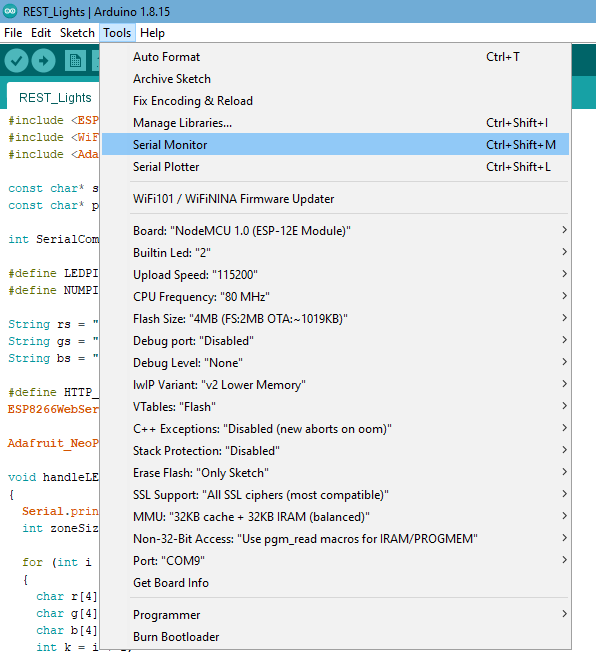

Next, select "Upload" and wait for the program to upload to your board. This may take some time, but you will be able to see some sort of progress in the bottom of the window.

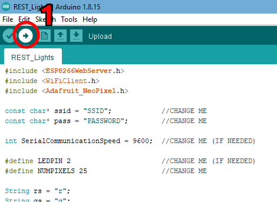

Once the upload has finished, the program should begin to run on the board. To see what is happening, bring up the serial monitor you opened earlier. After a few dots, the ESP8266 should connect to your network, displaying an IP address. This IP address will be super important later, so write it down.

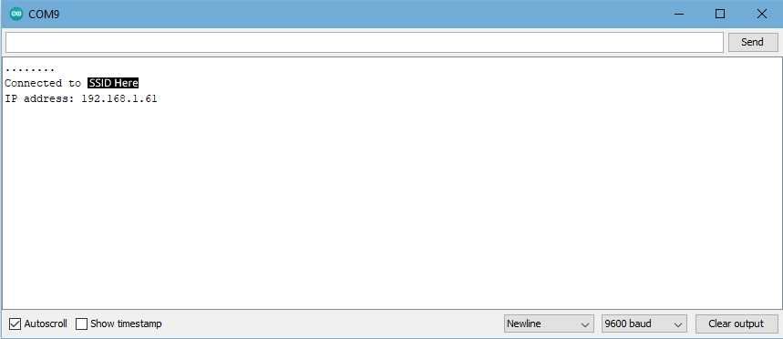

Congratulations! You have now properly prepared your ESP8266! You may now fully close the Arduino IDE.

## Installing the ESP8266 Chroma Control

First, download the latest release from the Releases page on GitHub, or .

After you have downloaded the installer, run it and navigate through as you please until you reach this page

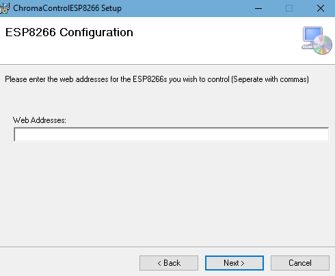

Here you will want to enter in the IP address for each of your ESP8266s in this format: `http://xxx.xxx.x.xxx:8080`. Separate different addresses with commas, and then press next to continue with the install.

Once the program has installed, Razer should recognize your lights and turn them on!
